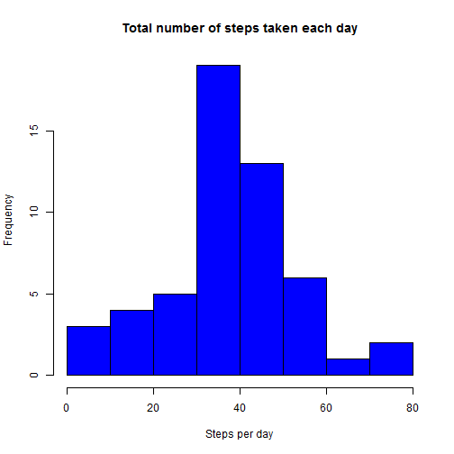
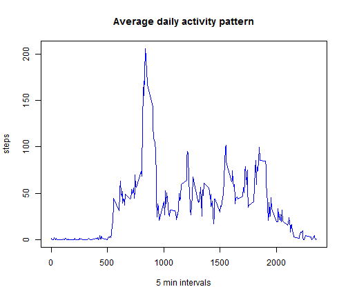
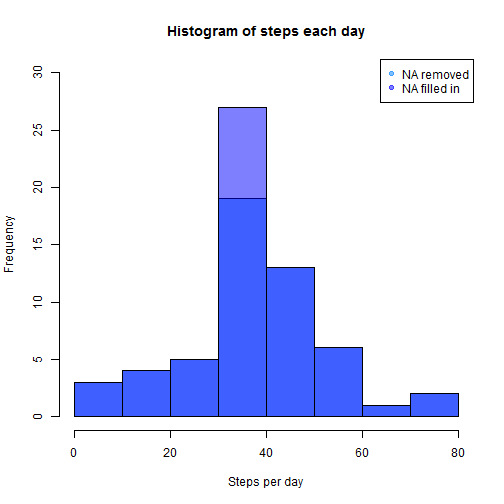
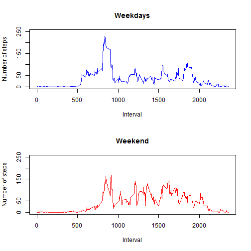

# Reproducible Research: Peer Assessment 1


## Loading and preprocessing the data

If CSV file does not exist, unzip the original ZIP file.
After loading the data, preprocess the date variable.


```r
if (!file.exists("activity.csv")) { 
  unzip("activity.zip") 
}
data <- read.csv("activity.csv")
data$date <- as.Date(data$date) 
```

## What is mean total number of steps taken per day?

Calculate the total number of steps per day ignoring missing values.


```r
stepspday <- tapply(data$steps, data$date, mean)
```

Make a histogram of the total number of steps taken each day.


```r
hist(stepspday, main = "Total number of steps taken each day", xlab = "Steps per day", col = "blue")
```

 

Calculate and report the mean and median total number of steps taken per day ignoring missing values.


```r
mean(stepspday, na.rm = TRUE)
```

```
## [1] 37.38
```

```r
median(stepspday, na.rm = TRUE)
```

```
## [1] 37.38
```

## What is the average daily activity pattern?

Calculate the average of steps taken at each interval across all days.


```r
mean.steps.interval <- tapply(data$steps, data$interval, function(x) mean(x, na.rm = TRUE))
```

Make a time series plot (i.e. `type = "l"`) of the 5-minute interval (x-axis) and the average number of steps taken, averaged across all days (y-axis).


```r
plot(rownames(mean.steps.interval),mean.steps.interval, type = "l", xlab = "5 min intervals", ylab = "steps", main = "Average daily activity pattern", col = "blue")
```

 

Find the 5-minute interval, on average across all the days in the dataset, that contains the maximum number of steps.


```r
names(which.max(mean.steps.interval))
```

```
## [1] "835"
```

## Imputing missing values

Calculate and report the total number of missing values in the dataset (i.e. the total number of rows with NAs)


```r
ok <- complete.cases(data)
sum(!ok)
```

```
## [1] 2304
```

Create a new dataset (`filled.data`) that is equal to the original dataset but with the missing data filled in, using the mean for that 5-minute interval as values for the missing data.


```r
missing <- is.na(data$steps)
missing.intervals <- data$interval[missing]
filled.data <- data
filled.data$steps[missing] <- mean.steps.interval[as.character(missing.intervals)]
```

Create histograms to compare the total number of steps per day before (`NA` value removed) and after (`NA` value filled in)


```r
stepspday2 <- tapply(filled.data$steps, filled.data$date, mean)
par(mfrow=c(1,1))
hist1 <- hist(stepspday, plot = FALSE)
hist2 <- hist(stepspday2, plot = FALSE)
plot(hist1, col = rgb(0, 0.5, 1, 0.5), xlim = c(0,80), ylim = c(0,30), main = "Histogram of steps each day", xlab= "Steps per day")
plot(hist2, col = rgb(0, 0, 1, 0.5), xlim = c(0,80), ylim = c(0,30), add = T)
legend("topright", col = c(rgb(0, 0.5, 1, 0.5), rgb(0, 0, 1, 0.5)),legend = c("NA removed", "NA filled in"), pch = c(19, 19))
```

 

```r
mean(stepspday2, na.rm = TRUE)
```

```
## [1] 37.38
```

```r
median(stepspday2, na.rm = TRUE)
```

```
## [1] 37.38
```

Comparing 6-number summaries of steps per day before and after filled in to evaluate the impact of filled in missing value


```r
summary(stepspday)
```

```
##    Min. 1st Qu.  Median    Mean 3rd Qu.    Max.    NA's 
##    0.14   30.70   37.40   37.40   46.20   73.60       8
```

```r
summary(stepspday2)
```

```
##    Min. 1st Qu.  Median    Mean 3rd Qu.    Max. 
##    0.14   34.10   37.40   37.40   44.50   73.60
```

**Conclusions:** Using the mean to fill the missing values had minimal impact on the estimates of the total daily number of steps because the mean and the median have not changed.

## Are there differences in activity patterns between weekdays and weekends?

Create a new factor variable in the dataset with two levels - "weekday" and "weekend" indicating whether a given date is a weekday or weekend day.


```r
days <- as.factor(ifelse(weekdays(filled.data$date) %in% c("Saturday", "Sunday"), "weekend", "weekday"))
```

Calculate the average number of steps taken per interval, averaged across all weekday days or weekend


```r
filled.data.days <- split(filled.data, days)
steps.interval.weekdays <- tapply(filled.data.days$weekday$steps, filled.data.days$weekday$interval, mean)
steps.interval.weekend <- tapply(filled.data.days$weekend$steps, filled.data.days$weekend$interval, mean)
```

Make a panel plot containing a time series plot (i.e. type = "l") of the 5-minute interval (x-axis) and the average number of steps taken, averaged across all weekday days or weekend days (y-axis).


```r
par(mfrow=c(2,1))
plot(names(steps.interval.weekdays), steps.interval.weekdays, type = "l", xlab = "Interval", ylab = "Number of steps", main = "Weekdays", ylim = c(0,250), col = "blue")
plot(names(steps.interval.weekend), steps.interval.weekend, type = "l", xlab = "Interval", ylab = "Number of steps", main = "Weekend", ylim = c(0,250), col = "red")
```

 
